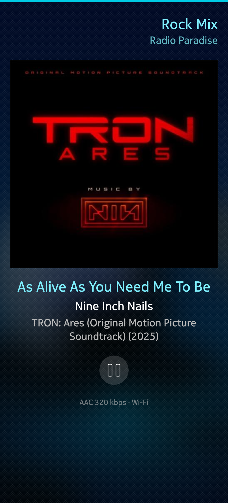
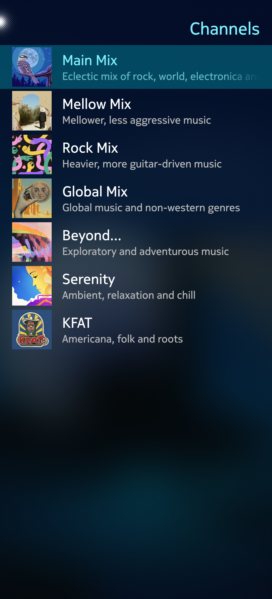
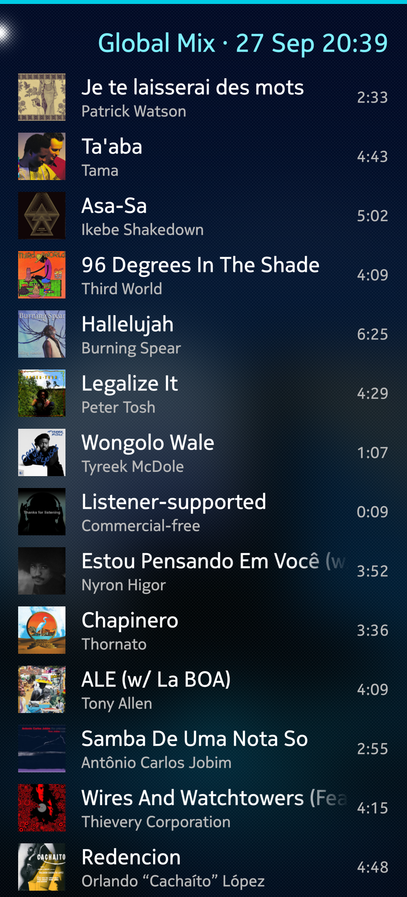
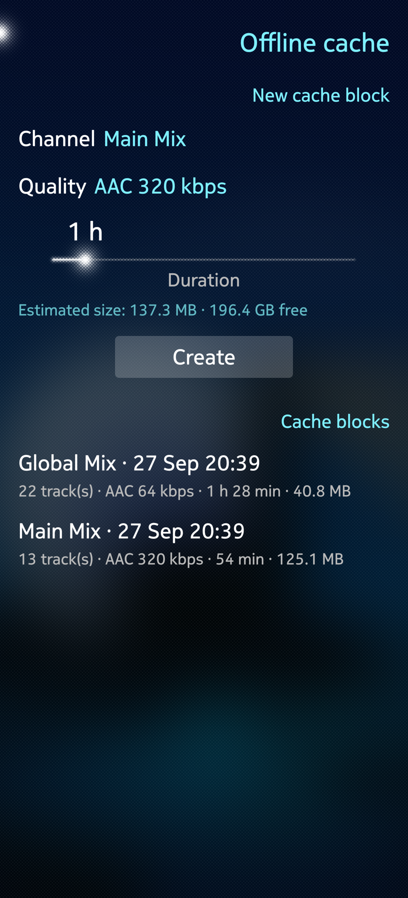
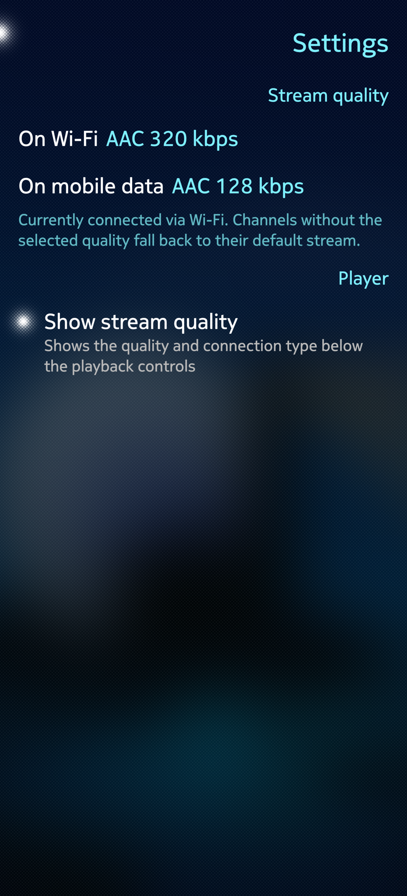

# Harbour-Sailparadise - A Radio Paradise client for the Sailfish operating system

## Summary

  

Sailparadise is a SailfishOS client for the webradio Radio Paradise (www.radioparadise.com).

From the Radio Paradise website:

> Radio Paradise streams highly curated, eclectic mixes of music -- chosen by real humans -- with unparalleled audio quality.
> 
> Our streams are uncontaminated by either algorithms or capitalism. Listening is always free. We are funded by listeners who like what we do, and pay money to help us keep doing it. For over two decades, Radio Paradise has been dedicated to preserving the art of radio DJ-ing and providing a soundtrack you can enjoy all day every day. Thanks for listening!
> We are consistently rated as one of the best internet radio stations worldwide. 

Radio Paradise is listener-supported. If you enjoy it, please consider [supporting them with a donation](https://radioparadise.com/donate).

## Main features of Sailparadise

- Streaming of the live radio with metadata (Artist, Album, Cover)
- Selection of all the Radio Paradise Channels and streaming codecs
- Pre-loading of the tracks for offline listening (cache blocks)
- Different streaming quality based on connection type (wifi vs mobile)
- Supported languages: English, Italian, Swedish

Currently not implemented:

- Lyrics
- Comments section
- Track description/Artist bio

## Screenshots

  
  
  
  
  

## Requirements

This has been tested on Sailfish 5.1 on a Jolla Phone 2026. I'm happy to compile other architectures for testing.

## Installation

The application is released on Github at the moment. Grab the RPM for your architecture in the "[Releases](https://github.com/spidernik84/harbour-sailparadise/releases)" section of this repository and install.
Once the code and the repo are fully ready, it will be released to Harbour and Chum.

## Notes on LLM

The app has been coded with the assistance of LLMs (Claude).

The development has been done iteratively, not in a single big-jump:

- I created branches, tags and did my best to understand what the LLMs were changing
- I focused on single features, tested them one by one, ironed out the bugs and marched on

While I am no professional, full-time programmer, I am no total stranger either: I have experience with Python scripting at least.

The idea is to have a working application first and progressively improve the generated code by hand.
The rationale: it is a simple, self contained client not dealing with personal data. Were it to handle sensitive credentials I would have not started the project at all.

The documentation, merging, release notes, changelog entries and comments are hand-typed with love by yours truly (at least that I can still do).

## Contributing

Please feel free to report bugs, suggest features and contribute with translations via PRs.
